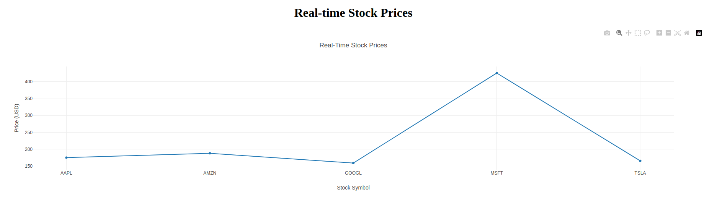

# Real-Time Stock Data

## Introduction

The "Real-Time Stock Data" application is a fully integrated solution designed to monitor and display stock price data in real-time. It leverages powerful technologies including Python, Apache Kafka for real-time data streaming, Redis for temporary data caching, and Flask for web-based visualization. This application pulls stock price data from Yahoo Finance, streams this data through Kafka, and displays it on a real-time dashboard built with dash library in flask. 

## Features

- **Real-Time Data Streaming**: Fetches and streams stock prices in real-time using Kafka.
- **Data Caching with Redis**: Utilizes Redis for efficient, temporary data storage to enhance data retrieval speeds.
- **Interactive Web Dashboard**: Features a Flask-based web dashboard that visualizes stock prices dynamically.
- **Scalable Architecture**: Designed to be scalable, supporting enhancements and integration with additional data sources and services.

## Prerequisites

Before you proceed, ensure you have the following installed:
- Python 3.8 or higher
- Redis server
- Apache Kafka
- An account with Confluent Cloud (for managed Kafka services)

## Setup Instructions

### Step 1: Clone the Repository

Clone the repository to your local machine:

```bash
git clone https://github.com/kaydata/real-time-stock-data.git
cd real-time-stock-data

```
### Step 2: Install Dependencies

```bash
pip install -r requirements.txt

```
### Step 3: Configure Environment Variables

Create a .env file in the root directory and populate it with the necessary Confluent Cloud Kafka credentials:

```bash
KAFKA_BOOTSTRAP_SERVERS=<Your Cluster Bootstrap Servers>
KAFKA_SASL_USERNAME=<Your SASL Username>
KAFKA_SASL_PASSWORD=<Your SASL Password>
REDIS_HOST=localhost
REDIS_PORT=6379

```
### Step 4: Set Up Confluent Cloud
- Log in to Confluent Cloud and set up a Kafka cluster.
- Create a topic named stock_prices.
- Note your cluster's credentials and update the .env file accordingly.

### Step 5: Start Redis Server

```bash
redis-server
```
### Step 6: Run the Producer
Start the producer script to fetch real-time stock data from Yahoo Finance and publish it to Kafka:

```bash
python producer.py
```
### Step 7: Run the Consumer
Start the consumer script to subscribe to the stock_prices topic from Kafka and store the data in Redis:

```bash
python consumer.py
```
### Step 8: Launch the Flask Application
Run the Flask web application to start the dashboard:

```bash
python app.py
```


#### Screenshot



## Contributing
Contributions are what make the open-source community such an amazing place to learn, inspire, and create. Any contributions you make are greatly appreciated.

- Fork the Project
- Create your Feature Branch (git checkout -b feature/AmazingFeature)
- Commit your Changes (git commit -m 'Add some AmazingFeature')
- Push to the Branch (git push origin feature/AmazingFeature)
- Open a Pull Request

